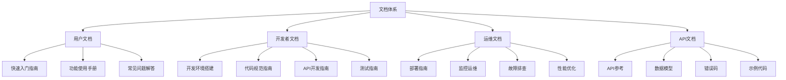

# ACRAC项目文档补全设计文档

## 概述

ACRAC医疗影像智能推荐系统文档补全项目旨在建立完整、标准化的文档体系，提升项目的可维护性、可扩展性和用户体验。基于现有项目架构和功能实现，设计一套系统性的文档补全方案。

## 指导文档对齐

### 技术标准 (tech.md)
- 遵循现有的FastAPI + React + PostgreSQL技术栈
- 保持与现有代码风格和架构模式的一致性
- 采用Markdown格式，支持多语言（中英文）
- 使用Mermaid图表进行架构和流程可视化

### 项目结构 (structure.md)
- 遵循现有的docs/目录结构
- 保持与.spec-workflow/规范工作流的一致性
- 按照功能模块组织文档层次结构
- 维护版本控制和文档更新机制

## 代码复用分析

### 现有组件利用
- **现有文档模板**: 利用.spec-workflow/templates/中的标准模板
- **项目结构**: 基于现有的docs/目录和文件组织方式
- **API文档**: 利用FastAPI自动生成的OpenAPI文档
- **代码注释**: 提取现有代码中的注释和文档字符串

### 集成点
- **现有API端点**: 为所有50+个API端点生成完整文档
- **前端组件**: 为9个核心页面组件创建使用指南
- **数据库模式**: 基于现有五表分离架构创建数据模型文档
- **部署配置**: 基于现有Docker和docker-compose配置创建部署指南

## 架构设计

### 模块化设计原则
- **单一文件职责**: 每个文档文件专注于一个特定功能模块
- **组件隔离**: 将API文档、用户指南、开发文档等分离
- **服务层分离**: 区分用户文档、开发者文档和运维文档
- **工具模块化**: 将文档生成、验证和更新工具模块化



## 组件和接口

### 文档生成组件
- **目的**: 自动化生成API文档和代码文档
- **接口**: 基于现有代码注释和OpenAPI规范
- **依赖**: FastAPI自动文档生成、代码解析工具
- **复用**: 利用现有的API端点和数据模型

### 文档验证组件
- **目的**: 确保文档的准确性和完整性
- **接口**: 链接检查、API测试、内容验证
- **依赖**: 自动化测试工具、链接检查器
- **复用**: 利用现有的测试框架和API测试用例

### 文档更新组件
- **目的**: 自动化文档更新和维护
- **接口**: 版本控制集成、变更检测、自动更新
- **依赖**: Git集成、文件监控、模板引擎
- **复用**: 利用现有的Git工作流和版本控制

## 数据模型

### 文档元数据模型
```
DocumentMetadata:
- id: string (文档唯一标识)
- title: string (文档标题)
- type: enum (user|developer|ops|api)
- category: string (文档分类)
- version: string (文档版本)
- last_updated: datetime (最后更新时间)
- author: string (作者)
- status: enum (draft|review|published)
- tags: array<string> (标签)
- dependencies: array<string> (依赖文档)
```

### API文档模型
```
APIDocument:
- endpoint: string (API端点)
- method: enum (GET|POST|PUT|DELETE)
- description: string (功能描述)
- parameters: array<Parameter> (参数列表)
- responses: array<Response> (响应格式)
- examples: array<Example> (示例代码)
- error_codes: array<ErrorCode> (错误码)
- rate_limits: RateLimit (限流信息)
```

### 用户指南模型
```
UserGuide:
- feature_name: string (功能名称)
- description: string (功能描述)
- prerequisites: array<string> (前置条件)
- steps: array<Step> (操作步骤)
- screenshots: array<string> (截图路径)
- tips: array<string> (使用技巧)
- troubleshooting: array<Issue> (故障排除)
```

## 错误处理

### 错误场景
1. **文档生成失败**
   - **处理**: 记录错误日志，提供回退到手动生成
   - **用户影响**: 显示错误信息，提供手动创建选项

2. **API文档不匹配**
   - **处理**: 自动检测差异，生成更新报告
   - **用户影响**: 显示警告信息，提供修复建议

3. **链接失效**
   - **处理**: 定期检查链接，自动更新或标记失效
   - **用户影响**: 显示链接状态，提供替代链接

4. **文档版本冲突**
   - **处理**: 版本合并策略，冲突解决机制
   - **用户影响**: 显示版本信息，提供选择界面

## 测试策略

### 单元测试
- 文档生成组件的功能测试
- 文档验证规则的正确性测试
- 模板渲染的准确性测试

### 集成测试
- API文档与代码的一致性测试
- 文档链接的有效性测试
- 跨模块文档的关联性测试

### 端到端测试
- 完整文档生成流程测试
- 用户文档使用场景测试
- 开发者文档实际应用测试

## 文档结构设计

### 用户文档结构
```
docs/user/
├── getting-started/
│   ├── quick-start.md
│   ├── installation.md
│   └── first-steps.md
├── features/
│   ├── intelligent-recommendation.md
│   ├── data-browser.md
│   ├── evaluation-tools.md
│   └── model-configuration.md
├── guides/
│   ├── clinical-scenarios.md
│   ├── data-import-export.md
│   └── troubleshooting.md
└── faq/
    ├── common-questions.md
    └── error-solutions.md
```

### 开发者文档结构
```
docs/developer/
├── setup/
│   ├── development-environment.md
│   ├── database-setup.md
│   └── testing-setup.md
├── architecture/
│   ├── system-overview.md
│   ├── data-models.md
│   └── api-architecture.md
├── development/
│   ├── coding-standards.md
│   ├── api-development.md
│   └── testing-guidelines.md
└── deployment/
    ├── build-process.md
    └── release-process.md
```

### API文档结构
```
docs/api/
├── reference/
│   ├── acrac-api.md
│   ├── vector-search-api.md
│   ├── evaluation-api.md
│   └── admin-api.md
├── models/
│   ├── data-models.md
│   ├── request-models.md
│   └── response-models.md
├── examples/
│   ├── basic-usage.md
│   ├── advanced-scenarios.md
│   └── integration-examples.md
└── errors/
    ├── error-codes.md
    └── troubleshooting.md
```

### 运维文档结构
```
docs/operations/
├── deployment/
│   ├── production-deployment.md
│   ├── docker-deployment.md
│   └── kubernetes-deployment.md
├── monitoring/
│   ├── system-monitoring.md
│   ├── performance-monitoring.md
│   └── alerting-setup.md
├── maintenance/
│   ├── backup-restore.md
│   ├── updates-upgrades.md
│   └── security-updates.md
└── troubleshooting/
    ├── common-issues.md
    ├── performance-issues.md
    └── emergency-procedures.md
```

## 文档质量标准

### 内容质量
- 准确性：所有信息必须与代码实现一致
- 完整性：覆盖所有功能和API端点
- 时效性：定期更新，保持与代码同步
- 可读性：清晰的结构，易懂的语言

### 技术标准
- 格式统一：使用标准Markdown格式
- 链接有效：所有内部和外部链接必须有效
- 代码示例：提供可运行的代码示例
- 图表清晰：使用Mermaid图表，确保可读性

### 维护标准
- 版本控制：所有文档变更必须记录
- 审查流程：重要文档变更需要审查
- 自动化：尽可能使用自动化工具
- 反馈机制：建立用户反馈和改进机制


