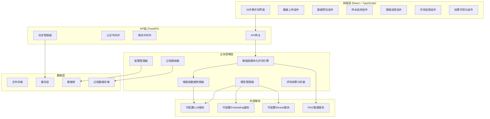

# RAGAS 评测功能完成和优化技术设计文档

## 概述

本设计文档基于已批准的需求文档，详细描述了 RAGAS 评测功能完成和优化的技术架构、组件设计和实现方案。系统采用模块化设计，支持通用评测任务，能够灵活配置不同的评测模型和流程，提供分步骤的前端评测体验。

## 技术标准对齐

### 技术标准 (tech.md)
- 遵循 FastAPI 后端架构模式，使用 Pydantic 进行数据验证
- 采用 React + TypeScript 前端架构，使用 Ant Design 组件库
- 遵循 RESTful API 设计原则，提供统一的 API 接口
- 使用 SQLAlchemy ORM 进行数据库操作，支持 PostgreSQL 数据库
- 采用异步编程模式，支持高并发处理

### 项目结构 (structure.md)
- 后端服务位于 `backend/app/` 目录，按功能模块组织
- 前端页面位于 `frontend/src/pages/` 目录
- API 端点位于 `backend/app/api/api_v1/endpoints/` 目录
- 数据模型位于 `backend/app/models/` 目录
- 服务层位于 `backend/app/services/` 目录

## 代码重用分析

### 现有组件利用
- **增强版 RAGAS 评估器**: 利用现有的 `enhanced_ragas_evaluator.py` 作为核心评估引擎，该评估器专门处理中文医学内容，具有更好的 LLM 输出解析能力
- **RAGAS 评估器 V2**: 作为备用评估器，利用现有的 `ragas_evaluator_v2.py`
- **前端评测界面**: 基于现有的 `RAGASEvalV2.tsx` 进行优化和扩展
- **API 路由系统**: 利用现有的 FastAPI 路由架构
- **数据库模型**: 利用现有的 `inference_logs` 表结构
- **配置管理**: 利用现有的配置管理系统

### 集成点
- **RAG 推理服务**: 集成现有的 `/api/v1/acrac/rag-llm/intelligent-recommendation` API
- **推理记录服务**: 集成现有的 `/api/v1/acrac/rag-llm/runs/log` API
- **数据库存储**: 利用现有的 PostgreSQL 数据库和表结构
- **文件存储**: 利用现有的文件上传和存储机制

## 架构设计

### 整体架构



### 模块化设计原则
- **单一文件职责**: 每个文件处理一个特定的关注点或领域
- **组件隔离**: 创建小型、专注的组件而非大型单体文件
- **服务层分离**: 分离数据访问、业务逻辑和表现层
- **工具模块化**: 将工具分解为专注的、单一用途的模块
- **插件化架构**: 支持不同评测指标和模型的插件式集成

## 组件和接口设计

### 1. 增强版模块化评测引擎 (EnhancedModularEvaluationEngine)

**目的**: 提供可配置、可扩展的 RAGAS 评测引擎，专门优化中文医学内容评测，支持通用评测任务

**接口**:
```python
class EnhancedModularEvaluationEngine:
    async def initialize_models(self, config: ModelConfig) -> None
    async def evaluate_sample(self, sample: EvaluationSample) -> EvaluationResult
    async def evaluate_batch(self, samples: List[EvaluationSample]) -> BatchEvaluationResult
    async def get_available_metrics(self) -> List[MetricInfo]
    async def update_config(self, config: EvaluationConfig) -> None
    async def _evaluate_faithfulness_enhanced(self, sample: SingleTurnSample) -> float
    async def _evaluate_context_precision_enhanced(self, sample: SingleTurnSample) -> float
    async def _evaluate_context_recall_enhanced(self, sample: SingleTurnSample) -> float
    async def _evaluate_answer_relevancy_enhanced(self, sample: SingleTurnSample) -> float
```

**核心特性**:
- **增强版中文支持**: 专门优化的中文医学内容评测逻辑
- **改进的 LLM 输出解析**: 支持 JSON 格式解析和启发式回退机制
- **医学领域优化**: 针对医学术语和临床指南的评测优化
- **错误处理增强**: 完善的异常处理和降级机制

**依赖**: 
- RAGAS 0.3.x 库
- 可配置的 LLM 和 Embedding 模型
- 数据转换器
- 中文医学知识库

**重用**: 基于现有的 `enhanced_ragas_evaluator.py` 进行重构和扩展

### 2. 分步骤前端评测流程 (StepBasedEvaluationFlow)

**目的**: 提供分步骤的评测界面，包括数据上传、解析、勾选、推理、评测和结果展示

**接口**:
```typescript
interface StepBasedEvaluationFlow {
  // 步骤1: 数据上传和解析
  uploadAndParseData(file: File): Promise<ParseResult>
  
  // 步骤2: 样本选择
  selectSamples(samples: TestCase[]): Promise<SelectedSamples>
  
  // 步骤3: 推理执行
  executeInference(samples: SelectedSamples): Promise<InferenceResult>
  
  // 步骤4: 推理结果可视化
  visualizeInferenceData(result: InferenceResult): Promise<void>
  
  // 步骤5: 评测样本选择
  selectEvaluationSamples(inferenceResult: InferenceResult): Promise<SelectedEvalSamples>
  
  // 步骤6: 评测执行
  executeEvaluation(samples: SelectedEvalSamples): Promise<EvaluationResult>
  
  // 步骤7: 结果可视化
  visualizeEvaluationResult(result: EvaluationResult): Promise<void>
}
```

**依赖**: 
- Ant Design 组件库
- 文件上传组件
- 数据表格组件
- 进度条组件

**重用**: 基于现有的 `RAGASEvalV2.tsx` 进行重构

### 3. 可配置模型管理器 (ConfigurableModelManager)

**目的**: 管理可配置的 LLM、Embedding 和 Rerank 模型

**接口**:
```python
class ConfigurableModelManager:
    async def load_llm_model(self, config: LLMConfig) -> LLMModel
    async def load_embedding_model(self, config: EmbeddingConfig) -> EmbeddingModel
    async def load_rerank_model(self, config: RerankConfig) -> RerankModel
    async def get_available_models(self) -> List[ModelInfo]
    async def validate_model_config(self, config: ModelConfig) -> ValidationResult
```

**依赖**: 
- LangChain 模型接口
- 配置管理系统
- 模型注册表

**重用**: 利用现有的配置管理系统

### 4. 过程数据跟踪器 (ProcessDataTracker)

**目的**: 跟踪和存储推理和评测的详细过程数据

**接口**:
```python
class ProcessDataTracker:
    async def track_inference_process(self, task_id: str, data: InferenceProcessData) -> None
    async def track_evaluation_process(self, task_id: str, data: EvaluationProcessData) -> None
    async def get_process_data(self, task_id: str) -> ProcessData
    async def visualize_process_data(self, task_id: str) -> VisualizationData
```

**依赖**: 
- 数据库存储
- 缓存系统
- 数据序列化

**重用**: 利用现有的数据库和缓存系统

### 5. 增强版数据转换器 (EnhancedDataConverter)

**目的**: 将不同格式的数据转换为增强版 RAGAS 评测格式，专门优化中文医学内容处理

**接口**:
```python
class EnhancedDataConverter:
    async def convert_rag_result(self, rag_result: RAGResult) -> RAGASSample
    async def convert_excel_data(self, excel_data: ExcelData) -> List[RAGASSample]
    async def validate_sample(self, sample: RAGASSample) -> ValidationResult
    async def normalize_contexts(self, contexts: List[str]) -> List[str]
    async def create_enhanced_sample(self, data: Dict[str, Any]) -> SingleTurnSample
    async def preprocess_chinese_content(self, content: str) -> str
    async def extract_medical_terms(self, text: str) -> List[str]
```

**核心特性**:
- **中文医学内容预处理**: 专门处理中文医学术语和概念
- **上下文智能过滤**: 过滤空上下文并提供默认值
- **医学术语提取**: 自动识别和提取医学专业术语
- **数据质量验证**: 增强的数据验证和错误处理

**依赖**: 
- 数据验证库
- 中文文本处理工具
- 医学术语库
- 格式转换器

**重用**: 基于现有的数据转换逻辑和 `enhanced_ragas_evaluator.py` 中的 `create_sample` 方法

### 6. 评测结果分析器 (EvaluationResultAnalyzer)

**目的**: 分析评测结果，提供详细的诊断和改进建议

**接口**:
```python
class EvaluationResultAnalyzer:
    async def analyze_scores(self, results: List[EvaluationResult]) -> AnalysisReport
    async def identify_issues(self, result: EvaluationResult) -> List[Issue]
    async def generate_improvement_suggestions(self, issues: List[Issue]) -> List[Suggestion]
    async def compare_with_baseline(self, results: List[EvaluationResult]) -> ComparisonReport
    async def export_analysis_report(self, analysis: AnalysisReport) -> str
```

**核心特性**:
- **智能问题诊断**: 自动识别评测中的问题
- **改进建议生成**: 基于评测结果提供具体的改进建议
- **基准对比**: 与历史数据或标准基准进行对比
- **可视化报告**: 生成易于理解的评测分析报告

**依赖**: 
- 数据分析库
- 可视化工具
- 报告生成器

**重用**: 基于现有的评测结果处理逻辑

## 数据模型

### 增强版评测样本模型 (EnhancedEvaluationSample)
```
EnhancedEvaluationSample:
- id: str (唯一标识符)
- question: str (问题文本)
- answer: str (生成的答案)
- contexts: List[str] (检索的上下文)
- ground_truth: Optional[str] (标准答案)
- medical_terms: List[str] (提取的医学术语)
- chinese_processed: bool (是否经过中文预处理)
- metadata: Dict[str, Any] (元数据)
- created_at: datetime (创建时间)
```

### 评测样本模型 (EvaluationSample)
```
EvaluationSample:
- id: str (唯一标识符)
- question: str (问题文本)
- answer: str (生成的答案)
- contexts: List[str] (检索的上下文)
- ground_truth: Optional[str] (标准答案)
- metadata: Dict[str, Any] (元数据)
- created_at: datetime (创建时间)
```

### 增强版评测结果模型 (EnhancedEvaluationResult)
```
EnhancedEvaluationResult:
- sample_id: str (样本ID)
- metrics: Dict[str, float] (评测指标分数)
- enhanced_metrics: Dict[str, float] (增强版评测指标分数)
- llm_parsing_success: bool (LLM输出解析是否成功)
- fallback_method_used: str (使用的回退方法)
- medical_term_analysis: Dict[str, Any] (医学术语分析结果)
- chinese_processing_info: Dict[str, Any] (中文处理信息)
- process_data: Dict[str, Any] (评测过程数据)
- status: str (评测状态)
- error_message: Optional[str] (错误信息)
- created_at: datetime (创建时间)
```

### 评测结果模型 (EvaluationResult)
```
EvaluationResult:
- sample_id: str (样本ID)
- metrics: Dict[str, float] (评测指标分数)
- process_data: Dict[str, Any] (评测过程数据)
- status: str (评测状态)
- error_message: Optional[str] (错误信息)
- created_at: datetime (创建时间)
```

### 任务模型 (EvaluationTask)
```
EvaluationTask:
- task_id: str (任务唯一标识符)
- status: str (任务状态)
- config: EvaluationConfig (评测配置)
- samples: List[EvaluationSample] (评测样本)
- results: List[EvaluationResult] (评测结果)
- process_data: ProcessData (过程数据)
- created_at: datetime (创建时间)
- completed_at: Optional[datetime] (完成时间)
```

### 模型配置模型 (ModelConfig)
```
ModelConfig:
- llm_config: LLMConfig (LLM模型配置)
- embedding_config: EmbeddingConfig (嵌入模型配置)
- rerank_config: Optional[RerankConfig] (重排序模型配置)
- evaluation_config: EvaluationConfig (评测配置)
- created_at: datetime (创建时间)
- updated_at: datetime (更新时间)
```

## 错误处理

### 错误场景

1. **模型加载失败**
   - **处理**: 提供降级方案，使用默认模型或返回错误信息
   - **用户影响**: 显示友好的错误提示，提供重试选项

2. **评测过程异常**
   - **处理**: 记录详细错误日志，提供部分结果
   - **用户影响**: 显示错误状态，提供重新评测选项

3. **数据格式错误**
   - **处理**: 验证数据格式，提供修复建议
   - **用户影响**: 显示数据验证错误，提供数据修复指导

4. **网络连接问题**
   - **处理**: 实现重试机制和超时处理
   - **用户影响**: 显示连接状态，提供手动重试选项

5. **存储空间不足**
   - **处理**: 清理临时文件，提供存储管理建议
   - **用户影响**: 显示存储警告，提供清理选项

## 测试策略

### 单元测试
- **评测引擎测试**: 测试各个评测指标的计算逻辑
- **数据转换测试**: 测试不同格式数据的转换功能
- **模型管理测试**: 测试模型加载和配置功能
- **错误处理测试**: 测试各种异常情况的处理

### 集成测试
- **API 集成测试**: 测试前后端 API 的集成
- **数据库集成测试**: 测试数据存储和检索功能
- **外部服务集成测试**: 测试与 LLM 和 RAG 服务的集成

### 端到端测试
- **完整评测流程测试**: 测试从数据上传到结果展示的完整流程
- **多用户并发测试**: 测试多用户同时进行评测的场景
- **性能压力测试**: 测试大量数据评测的性能表现

## 部署和配置

### 环境配置
- **开发环境**: 使用本地模型和数据库
- **测试环境**: 使用测试数据和模拟服务
- **生产环境**: 使用生产级模型和数据库

### 配置管理
- **模型配置**: 支持动态配置不同的 LLM 和 Embedding 模型
- **评测配置**: 支持配置评测参数和阈值
- **系统配置**: 支持配置并发数、超时时间等系统参数

### 监控和日志
- **性能监控**: 监控评测性能和资源使用情况
- **错误监控**: 监控系统错误和异常情况
- **用户行为监控**: 监控用户使用情况和反馈

## 安全考虑

### 数据安全
- **数据加密**: 对敏感数据进行加密存储
- **访问控制**: 实现基于角色的访问控制
- **数据脱敏**: 对评测数据进行脱敏处理

### 系统安全
- **输入验证**: 严格验证所有输入数据
- **API 安全**: 实现 API 认证和授权
- **日志安全**: 确保日志不包含敏感信息
