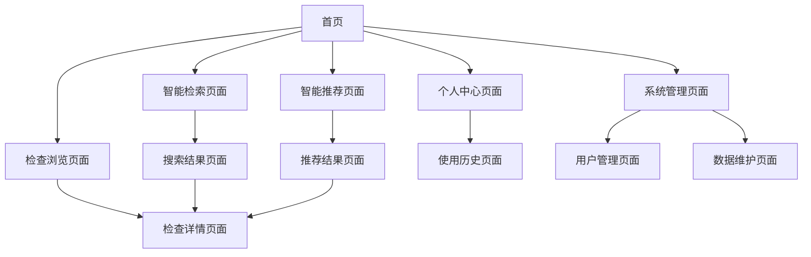

# ACRAC医疗影像检查推荐系统产品需求文档

## 1. 产品概述

ACRAC是一个面向临床医生的智能影像检查推荐系统，通过AI驱动的语义检索和推理服务，为医生提供精准的检查项目推荐和临床决策支持。

系统解决临床检查项目选择复杂、决策效率低的问题，为临床医生、影像科医生和医疗机构提供智能化的检查推荐服务。

目标是打造国内领先的医疗AI决策支持平台，提升临床诊疗效率和医疗服务质量。

## 2. 核心功能

### 2.1 用户角色

| 角色 | 注册方式 | 核心权限 |
|------|----------|----------|
| 临床医生 | 邮箱注册 + 医师资格验证 | 检查推荐、病例查询、推理服务 |
| 影像科医生 | 邮箱注册 + 科室验证 | 全部查询功能、数据审核、质量评估 |
| 系统管理员 | 超级管理员授权 | 用户管理、系统配置、数据维护 |

### 2.2 功能模块

系统包含以下核心页面：

1. **首页**：系统概览、快速导航、数据统计展示
2. **智能推荐页面**：临床场景输入、AI推荐结果、推理解释
3. **检查浏览页面**：检查项目分类浏览、详细信息查看
4. **智能检索页面**：语义搜索、多维度筛选、结果排序
5. **个人中心页面**：用户信息、使用历史、偏好设置
6. **系统管理页面**：用户管理、数据维护、系统配置

### 2.3 页面详情

| 页面名称 | 模块名称 | 功能描述 |
|----------|----------|----------|
| 首页 | 数据概览 | 显示系统数据统计、检查项目总数、用户活跃度等关键指标 |
| 首页 | 快速导航 | 提供智能推荐、检查浏览、智能检索三个核心功能的快速入口 |
| 首页 | 最近使用 | 展示用户最近查询的检查项目和推荐历史 |
| 智能推荐页面 | 场景输入 | 支持自然语言描述临床场景，包含患者信息、症状描述等 |
| 智能推荐页面 | AI推荐 | 基于三种算法(标准RAG、规则优先、案例投票)提供检查推荐 |
| 智能推荐页面 | 推理解释 | 显示推荐理由、置信度、相关指南和证据链 |
| 检查浏览页面 | 分类导航 | 按Panel→Topic→Variant→Procedure四层结构组织检查项目 |
| 检查浏览页面 | 项目详情 | 显示检查项目的适应症、禁忌症、辐射剂量、费用等信息 |
| 检查浏览页面 | 关联推荐 | 基于当前查看项目推荐相关或替代检查方案 |
| 智能检索页面 | 语义搜索 | 支持中英文关键词搜索，智能理解医学术语和同义词 |
| 智能检索页面 | 高级筛选 | 按检查部位、检查方式、适应症等维度进行精确筛选 |
| 智能检索页面 | 结果展示 | 显示搜索结果列表，包含相关性评分和快速预览 |
| 个人中心页面 | 用户信息 | 管理个人资料、科室信息、专业认证等 |
| 个人中心页面 | 使用历史 | 查看推荐历史、搜索记录、收藏的检查项目 |
| 个人中心页面 | 偏好设置 | 设置界面语言、推荐偏好、通知设置等 |
| 系统管理页面 | 用户管理 | 用户注册审核、角色分配、权限管理 |
| 系统管理页面 | 数据维护 | 检查项目数据更新、质量检查、版本管理 |
| 系统管理页面 | 系统监控 | 查看系统运行状态、API调用统计、错误日志 |

## 3. 核心流程

### 智能推荐流程
临床医生在推荐页面输入患者临床场景，系统自动分析并调用三种推理算法，返回排序的检查推荐列表，医生可查看详细推理过程和相关指南。

### 检查浏览流程
用户从首页进入检查浏览，通过四层分类结构逐步定位到具体检查项目，查看详细信息并获得相关推荐。

### 智能检索流程
用户输入搜索关键词，系统执行语义理解和向量检索，返回相关性排序的结果，用户可进一步筛选和查看详情。

## 4. 用户界面设计

### 4.1 设计风格

- **主色调**：医疗蓝(#1890FF)作为主色，纯白(#FFFFFF)作为背景色
- **辅助色**：成功绿(#52C41A)、警告橙(#FAAD14)、错误红(#FF4D4F)、中性灰(#8C8C8C)
- **按钮样式**：现代圆角按钮，主按钮采用渐变效果，支持悬停和点击动画
- **字体**：中文使用苹方/微软雅黑，英文使用Inter，主要字号14px，标题字号18-24px
- **布局风格**：极简卡片式设计，顶部固定导航，左侧可收缩菜单，主内容区域采用栅格布局
- **图标风格**：线性图标，统一使用Ant Design Icons，支持主题色彩适配

### 4.2 页面设计概览

| 页面名称 | 模块名称 | UI元素 |
|----------|----------|--------|
| 首页 | 数据概览 | 统计卡片、数字动画、进度环形图、趋势图表 |
| 首页 | 快速导航 | 大图标卡片、悬停效果、渐变背景、引导文案 |
| 智能推荐页面 | 场景输入 | 智能文本框、语音输入按钮、模板选择、实时提示 |
| 智能推荐页面 | 推荐结果 | 推荐卡片、置信度条、展开详情、收藏按钮 |
| 检查浏览页面 | 分类导航 | 面包屑导航、树形菜单、搜索框、筛选标签 |
| 检查浏览页面 | 项目列表 | 网格布局、项目卡片、快速预览、批量操作 |
| 智能检索页面 | 搜索界面 | 智能搜索框、搜索建议、历史记录、高级筛选面板 |
| 智能检索页面 | 结果展示 | 列表视图、卡片视图切换、排序选项、分页组件 |
| 个人中心页面 | 用户信息 | 头像上传、表单编辑、验证状态、保存提示 |
| 个人中心页面 | 历史记录 | 时间轴布局、搜索过滤、导出功能、清空选项 |

### 4.3 响应式设计

系统采用移动优先的响应式设计，完美适配桌面端(1200px+)、平板端(768-1199px)和移动端(320-767px)。移动端优化触摸交互，简化操作流程，保证核心功能的可用性。桌面端提供完整功能体验，支持键盘快捷键和高效操作。

## 5. 系统复核结果与实施计划

### 5.1 技术架构复核发现

**关键问题识别：**
1. **数据库架构不一致**：模型定义与SQL脚本存在差异，需要统一为五表分离架构
2. **后端服务缺失**：intelligent_recommendation_service.py文件丢失，导致服务启动失败
3. **推荐理由字段**：已在ClinicalRecommendation表中完整实现，无需额外开发
4. **向量数据库**：构建方案完整，需验证实际构建状态

### 5.2 分阶段实施计划

**第一阶段：紧急修复（1-2天）**
- 优先级：🔴 紧急
- 任务：修复后端服务启动问题
- 内容：创建缺失的智能推荐服务文件
- 目标：确保后端API正常运行

**第二阶段：数据库统一（2-3天）**
- 优先级：🟡 高
- 任务：统一数据库架构
- 内容：更新SQL脚本，重新构建数据库
- 目标：数据模型与应用代码完全匹配

**第三阶段：基础功能开发（1-2周）**
- 优先级：🟢 中
- 任务：ACR-AC数据展示和查询
- 内容：
  - 首页数据概览和统计
  - 检查浏览页面（Panel→Topic→ClinicalScenario）
  - 基础搜索和筛选功能
  - 检查项目详情页面
- 目标：用户可以浏览和查询所有ACR数据

**第四阶段：智能功能开发（2-3周）**
- 优先级：🟢 中
- 任务：向量查询和LLM推理
- 内容：
  - 语义搜索功能
  - 智能推荐页面
  - RAG推理模块
  - 推荐结果展示和解释
- 目标：提供完整的AI驱动推荐服务

**第五阶段：用户体验优化（1周）**
- 优先级：🔵 低
- 任务：完善用户功能
- 内容：
  - 个人中心和用户管理
  - 使用历史和收藏功能
  - 系统管理和数据维护
- 目标：提供完整的用户体验

### 5.3 功能优先级调整

基于复核结果，调整原有功能优先级：

**核心功能（必须实现）：**
- ✅ 数据浏览和基础查询
- ✅ 检查项目详情展示
- ✅ 基础统计和概览

**重要功能（优先实现）：**
- 🔄 语义搜索和向量查询
- 🔄 智能推荐和推理解释
- 🔄 用户认证和权限管理

**增强功能（后续实现）：**
- ⏳ 高级筛选和排序
- ⏳ 数据导出和报告
- ⏳ 系统监控和日志

### 5.4 技术风险评估

**高风险项：**
- 数据库架构迁移可能影响现有数据
- LLM服务集成的稳定性和性能
- 向量数据库的查询效率

**缓解措施：**
- 数据库迁移前完整备份
- LLM服务降级方案设计
- 向量索引优化和缓存策略