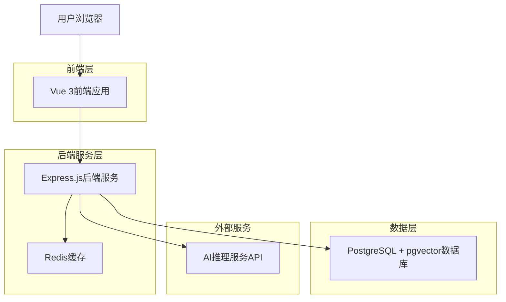
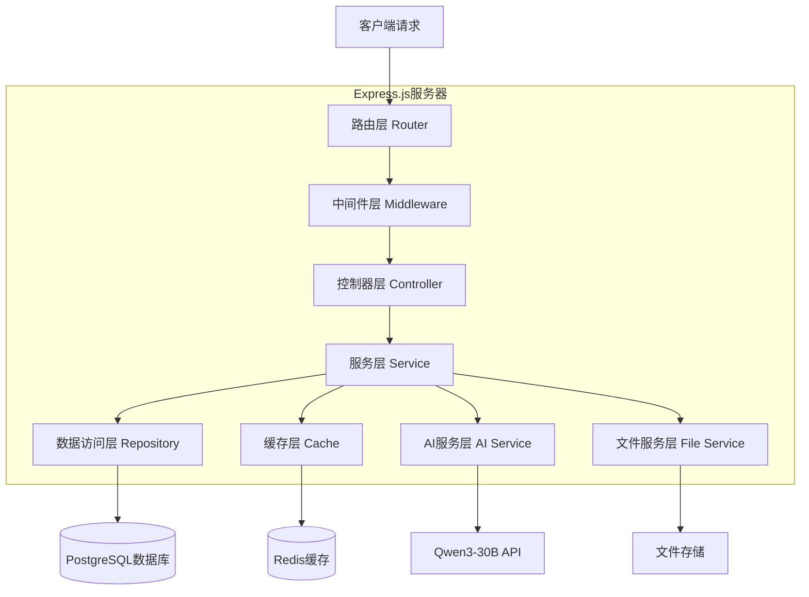
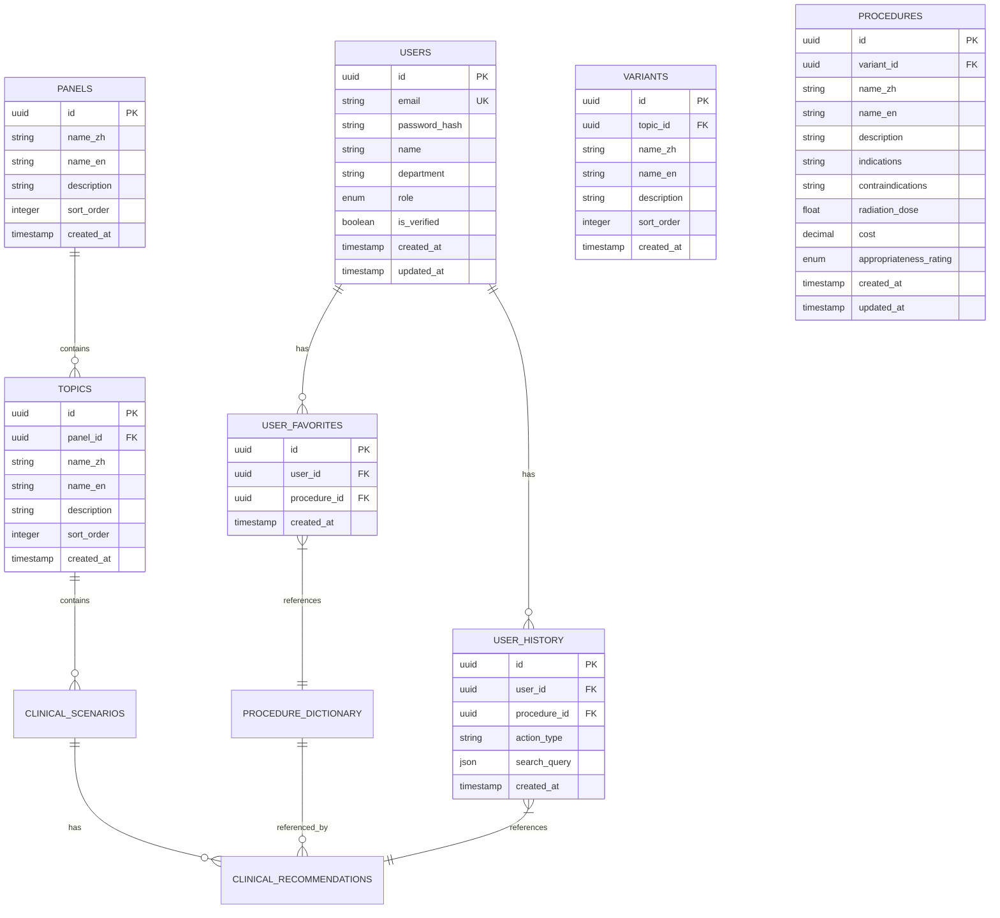

# ACRAC系统技术架构文档

## 1. 架构设计



## 2. 技术描述

* 前端：Vue\@3 + TypeScript + Ant Design Vue + Pinia + Vite + TailwindCSS

* 后端：Express.js\@4 + TypeScript + Prisma ORM

* 数据库：PostgreSQL\@15 + pgvector扩展

* 缓存：Redis\@7

* AI服务：Qwen3-30B API + BGE向量模型

* 部署：Docker + Docker Compose + Nginx

## 3. 路由定义

| 路由         | 用途               |
| ---------- | ---------------- |
| /          | 首页，显示系统概览和快速导航   |
| /login     | 登录页面，用户身份验证      |
| /register  | 注册页面，新用户注册申请     |
| /recommend | 智能推荐页面，临床场景AI推荐  |
| /browse    | 检查浏览页面，分类浏览检查项目  |
| /search    | 智能检索页面，语义搜索功能    |
| /profile   | 个人中心页面，用户信息和历史记录 |
| /admin     | 系统管理页面，用户和数据管理   |

## 4. API定义

### 4.1 核心API

#### 用户认证相关

```
POST /api/auth/login
POST /api/auth/register
POST /api/auth/logout
GET /api/auth/profile
```

请求参数（登录）：

| 参数名      | 参数类型   | 是否必需 | 描述   |
| -------- | ------ | ---- | ---- |
| email    | string | true | 用户邮箱 |
| password | string | true | 用户密码 |

响应参数：

| 参数名     | 参数类型    | 描述      |
| ------- | ------- | ------- |
| success | boolean | 登录是否成功  |
| token   | string  | JWT访问令牌 |
| user    | object  | 用户信息对象  |

#### 智能推荐相关

```
POST /api/recommend
```

请求参数：

| 参数名             | 参数类型   | 是否必需  | 描述     |
| --------------- | ------ | ----- | ------ |
| scenario        | string | true  | 临床场景描述 |
| patient\_age    | number | false | 患者年龄   |
| patient\_gender | string | false | 患者性别   |
| symptoms        | array  | false | 症状列表   |

响应参数：

| 参数名             | 参数类型   | 描述       |
| --------------- | ------ | -------- |
| recommendations | array  | 推荐检查项目列表 |
| confidence      | number | 推荐置信度    |
| reasoning       | string | 推荐理由说明   |
| alternatives    | array  | 替代方案     |

#### 检查浏览相关

```
GET /api/browse/panels
GET /api/browse/topics/:panelId
GET /api/browse/variants/:topicId
GET /api/browse/procedures/:variantId
GET /api/browse/procedure/:id
```

#### 智能检索相关

```
POST /api/search
```

请求参数：

| 参数名     | 参数类型   | 是否必需  | 描述    |
| ------- | ------ | ----- | ----- |
| query   | string | true  | 搜索关键词 |
| filters | object | false | 筛选条件  |
| page    | number | false | 页码    |
| limit   | number | false | 每页数量  |

#### 用户历史相关

```
GET /api/user/history
POST /api/user/favorites
DELETE /api/user/favorites/:id
```

## 5. 服务器架构图



## 6. 数据模型

### 6.1 架构复核发现的关键问题

**问题1：数据库架构不一致**
- 模型定义(acrac_models.py)：使用五表分离架构 Panel→Topic→ClinicalScenario→ProcedureDictionary→ClinicalRecommendation
- SQL脚本(00_create_tables.sql)：使用四表架构 Panel→Topic→Variant→Procedure
- **影响**：导致数据库创建与应用模型不匹配，需要统一架构

**问题2：缺失关键服务文件**
- 缺失文件：`app/services/intelligent_recommendation_service.py`
- **影响**：后端服务启动失败，智能分析API无法使用
- 状态：__pycache__中存在编译文件，说明之前存在过该文件

**问题3：推荐理由字段状态**
- ✅ 已存在：ClinicalRecommendation表中包含reasoning_en/reasoning_zh字段
- ✅ 字段完整：支持中英文推荐理由存储
- 无需额外开发

**问题4：向量数据库构建状态**
- 构建脚本：存在完整的向量构建方案
- 数据源：ACR_final.csv文件可用
- 需要验证：实际数据库构建状态

### 6.2 统一后的数据模型定义



## 7. 问题解决方案与实施优先级

### 7.1 紧急修复任务（优先级：高）

**任务1：修复后端服务启动问题**
- 创建缺失的 `intelligent_recommendation_service.py` 文件
- 实现 `IntelligentRecommendationService` 类
- 确保与现有API端点兼容
- 预计时间：2-4小时

**任务2：统一数据库架构**
- 选择架构方案：推荐使用五表分离架构（更符合医疗数据特点）
- 更新SQL创建脚本以匹配模型定义
- 重新构建数据库
- 预计时间：4-6小时

### 7.2 基础功能开发（优先级：中）

**阶段1：ACR-AC数据展示和查询**
- 实现Panel/Topic/ClinicalScenario的基础CRUD操作
- 开发数据浏览和搜索功能
- 创建数据统计和概览页面
- 预计时间：1-2天

**阶段2：向量查询功能**
- 验证向量数据库构建状态
- 实现语义搜索API
- 开发向量相似度查询
- 预计时间：2-3天

**阶段3：LLM+RAG推理模块**
- 集成LLM服务
- 实现RAG推理逻辑
- 开发智能推荐功能
- 预计时间：3-5天

### 7.3 前端开发计划

**第一阶段：基础页面**
- 首页数据概览
- 检查浏览页面
- 基础搜索功能

**第二阶段：智能功能**
- 智能推荐页面
- 语义搜索界面
- 结果展示优化

**第三阶段：用户体验**
- 个人中心
- 历史记录
- 系统管理

### 6.3 数据定义语言（统一后的架构）

#### 用户表 (users)

```sql
CREATE TABLE users (
    id UUID PRIMARY KEY DEFAULT gen_random_uuid(),
    email VARCHAR(255) UNIQUE NOT NULL,
    password_hash VARCHAR(255) NOT NULL,
    name VARCHAR(100) NOT NULL,
    department VARCHAR(100),
    role VARCHAR(20) DEFAULT 'doctor' CHECK (role IN ('doctor', 'radiologist', 'admin')),
    is_verified BOOLEAN DEFAULT false,
    created_at TIMESTAMP WITH TIME ZONE DEFAULT NOW(),
    updated_at TIMESTAMP WITH TIME ZONE DEFAULT NOW()
);

CREATE INDEX idx_users_email ON users(email);
CREATE INDEX idx_users_role ON users(role);
```

#### 检查项目层级表

```sql
CREATE TABLE panels (
    id UUID PRIMARY KEY DEFAULT gen_random_uuid(),
    name_zh VARCHAR(255) NOT NULL,
    name_en VARCHAR(255) NOT NULL,
    description TEXT,
    sort_order INTEGER DEFAULT 0,
    created_at TIMESTAMP WITH TIME ZONE DEFAULT NOW()
);

CREATE TABLE topics (
    id UUID PRIMARY KEY DEFAULT gen_random_uuid(),
    panel_id UUID REFERENCES panels(id) ON DELETE CASCADE,
    name_zh VARCHAR(255) NOT NULL,
    name_en VARCHAR(255) NOT NULL,
    description TEXT,
    sort_order INTEGER DEFAULT 0,
    created_at TIMESTAMP WITH TIME ZONE DEFAULT NOW()
);

CREATE TABLE variants (
    id UUID PRIMARY KEY DEFAULT gen_random_uuid(),
    topic_id UUID REFERENCES topics(id) ON DELETE CASCADE,
    name_zh VARCHAR(255) NOT NULL,
    name_en VARCHAR(255) NOT NULL,
    description TEXT,
    sort_order INTEGER DEFAULT 0,
    created_at TIMESTAMP WITH TIME ZONE DEFAULT NOW()
);

CREATE TABLE procedures (
    id UUID PRIMARY KEY DEFAULT gen_random_uuid(),
    variant_id UUID REFERENCES variants(id) ON DELETE CASCADE,
    name_zh VARCHAR(255) NOT NULL,
    name_en VARCHAR(255) NOT NULL,
    description TEXT,
    indications TEXT,
    contraindications TEXT,
    radiation_dose FLOAT,
    cost DECIMAL(10,2),
    appropriateness_rating INTEGER CHECK (appropriateness_rating BETWEEN 1 AND 9),
    created_at TIMESTAMP WITH TIME ZONE DEFAULT NOW(),
    updated_at TIMESTAMP WITH TIME ZONE DEFAULT NOW()
);

CREATE INDEX idx_procedures_variant_id ON procedures(variant_id);
CREATE INDEX idx_procedures_name_zh ON procedures(name_zh);
CREATE INDEX idx_procedures_name_en ON procedures(name_en);
```

#### 用户历史和收藏表

```sql
CREATE TABLE user_history (
    id UUID PRIMARY KEY DEFAULT gen_random_uuid(),
    user_id UUID REFERENCES users(id) ON DELETE CASCADE,
    procedure_id UUID REFERENCES procedures(id) ON DELETE CASCADE,
    action_type VARCHAR(50) NOT NULL,
    search_query JSONB,
    created_at TIMESTAMP WITH TIME ZONE DEFAULT NOW()
);

CREATE TABLE user_favorites (
    id UUID PRIMARY KEY DEFAULT gen_random_uuid(),
    user_id UUID REFERENCES users(id) ON DELETE CASCADE,
    procedure_id UUID REFERENCES procedures(id) ON DELETE CASCADE,
    created_at TIMESTAMP WITH TIME ZONE DEFAULT NOW(),
    UNIQUE(user_id, procedure_id)
);

CREATE INDEX idx_user_history_user_id ON user_history(user_id);
CREATE INDEX idx_user_history_created_at ON user_history(created_at DESC);
CREATE INDEX idx_user_favorites_user_id ON user_favorites(user_id);
```

```
modality_id UUID REFERENCES modalities(id),
anatomical_site_id UUID REFERENCES anatomical_sites(id),
created_at TIMESTAMP WITH TIME ZONE DEFAULT NOW(),
updated_at TIMESTAMP WITH TIME ZONE DEFAULT NOW()
```

);

\-- 创建索引
CREATE INDEX idx\_procedures\_variant\_id ON procedures(variant\_id);
CREATE INDEX idx\_procedures\_modality\_id ON procedures(modality\_id);
CREATE INDEX idx\_procedures\_anatomical\_site\_id ON procedures(anatomical\_site\_id);
CREATE INDEX idx\_procedures\_appropriateness\_score ON procedures(appropriateness\_score);

````

#### 向量嵌入表 (procedure_embeddings)
```sql
-- 启用pgvector扩展
CREATE EXTENSION IF NOT EXISTS vector;

-- 创建向量嵌入表
CREATE TABLE procedure_embeddings (
    id UUID PRIMARY KEY DEFAULT gen_random_uuid(),
    procedure_id UUID NOT NULL REFERENCES procedures(id) ON DELETE CASCADE,
    emb_zh vector(1536),
    emb_en vector(1536),
    created_at TIMESTAMP WITH TIME ZONE DEFAULT NOW()
);

-- 创建向量索引
CREATE INDEX idx_procedure_embeddings_zh_hnsw ON procedure_embeddings USING hnsw (emb_zh vector_cosine_ops);
CREATE INDEX idx_procedure_embeddings_en_hnsw ON procedure_embeddings USING hnsw (emb_en vector_cosine_ops);
CREATE INDEX idx_procedure_embeddings_procedure_id ON procedure_embeddings(procedure_id);
````

#### 模态字典表 (modalities)

```sql
-- 创建模态字典表
CREATE TABLE modalities (
    id UUID PRIMARY KEY DEFAULT gen_random_uuid(),
    name_en VARCHAR(100) NOT NULL,
    name_zh VARCHAR(100),
    code VARCHAR(20) UNIQUE NOT NULL,
    created_at TIMESTAMP WITH TIME ZONE DEFAULT NOW()
);

-- 插入初始数据
INSERT INTO modalities (name_en, name_zh, code) VALUES
('CT', 'CT扫描', 'CT'),
('MRI', '磁共振成像', 'MRI'),
('Ultrasound', '超声检查', 'US'),
('X-ray', 'X射线检查', 'XR'),
('Nuclear Medicine', '核医学检查', 'NM'),
('PET', '正电子发射断层扫描', 'PET');
```

#### 解剖部位表 (anatomical\_sites)

```sql
-- 创建解剖部位表
CREATE TABLE anatomical_sites (
    id UUID PRIMARY KEY DEFAULT gen_random_uuid(),
    name_en VARCHAR(100) NOT NULL,
    name_zh VARCHAR(100),
    code VARCHAR(20) UNIQUE NOT NULL,
    parent_id UUID REFERENCES anatomical_sites(id),
    created_at TIMESTAMP WITH TIME ZONE DEFAULT NOW()
);

-- 创建索引
CREATE INDEX idx_anatomical_sites_parent_id ON anatomical_sites(parent_id);
CREATE INDEX idx_anatomical_sites_code ON anatomical_sites(code);
```

#### 规则表 (rules)

```sql
-- 创建规则表
CREATE TABLE rules (
    id UUID PRIMARY KEY DEFAULT gen_random_uuid(),
    name VARCHAR(255) NOT NULL,
    condition_json JSONB NOT NULL,
    action_json JSONB NOT NULL,
    is_active BOOLEAN DEFAULT true,
    version INTEGER DEFAULT 1,
    created_by UUID NOT NULL REFERENCES users(id),
    created_at TIMESTAMP WITH TIME ZONE DEFAULT NOW()
);

-- 创建索引
CREATE INDEX idx_rules_is_active ON rules(is_active);
CREATE INDEX idx_rules_created_by ON rules(created_by);
CREATE INDEX idx_rules_condition_gin ON rules USING gin(condition_json);
```

#### 审计日志表 (audit\_logs)

```sql
-- 创建审计日志表
CREATE TABLE audit_logs (
    id UUID PRIMARY KEY DEFAULT gen_random_uuid(),
    user_id UUID NOT NULL REFERENCES users(id),
    action VARCHAR(50) NOT NULL,
    resource_type VARCHAR(50) NOT NULL,
    resource_id UUID,
    old_values JSONB,
    new_values JSONB,
    created_at TIMESTAMP WITH TIME ZONE DEFAULT NOW()
);

-- 创建索引
CREATE INDEX idx_audit_logs_user_id ON audit_logs(user_id);
CREATE INDEX idx_audit_logs_created_at ON audit_logs(created_at DESC);
CREATE INDEX idx_audit_logs_resource ON audit_logs(resource_type, resource_id);
```

