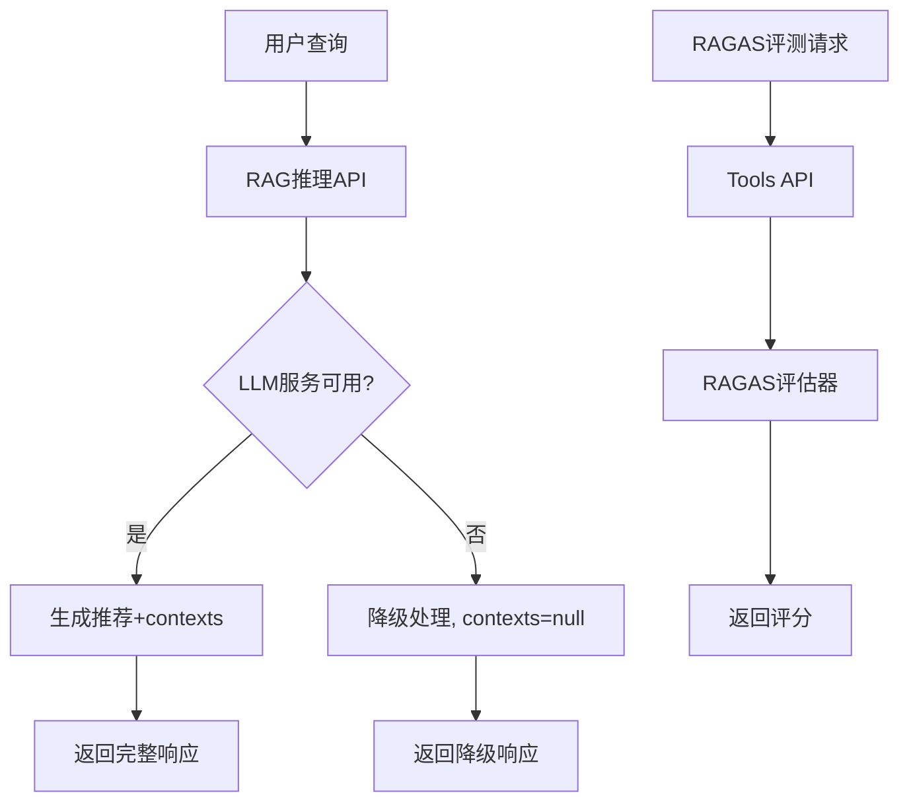

# RAGAS评测系统当前流程分析报告

## 执行摘要

本报告详细分析了ACRAC系统中RAGAS评测功能的当前状态，通过系统性测试发现了关键问题并提供了解决方案。主要发现包括：RAGAS评估器本身功能正常，但存在API集成、数据流和配置问题。

## 测试结果概览

### 1. RAGAS核心功能测试 ✅

**测试脚本**: `test_ragas_simple.py` 和 `test_ragas_medical.py`

**结果**: RAGAS评估器本身工作正常，能够成功计算各项指标：

```json
{
  "faithfulness": 0.2639,      // 忠实度评分正常
  "answer_relevancy": NaN,     // 答案相关性异常
  "context_precision": 1.0000, // 上下文精确度正常  
  "context_recall": 1.0000     // 上下文召回率正常
}
```

### 2. API集成测试结果

#### RAG推理API测试 ❌
- **端点**: `/api/v1/acrac/rag-llm/intelligent-recommendation`
- **问题**: contexts字段返回null
- **原因**: LLM服务连接失败，触发降级处理

#### RAGAS评测API测试 ⚠️
- **可用端点**: `/api/v1/acrac/tools/ragas/score`
- **问题**: 评分均为0.0，可能由于输入数据格式或配置问题
- **不可用端点**: 多个RAGAS相关路由被注释

## 发现的关键问题

### 1. LLM服务连接问题 🔴 高优先级

**现象**:
```
ConnectionError: HTTPSConnectionPool(host='api.siliconflow.cn', port=443): 
Max retries exceeded with url: /v1/chat/completions
```

**影响**: 
- RAG推理失败，contexts为空
- 导致RAGAS faithfulness评分异常

**解决方案**:
- 检查网络连接和API密钥配置
- 实现更好的错误处理和重试机制
- 考虑本地LLM备选方案

### 2. API路由配置混乱 🟡 中优先级

**现状**:
```python
# api.py中的路由配置
api_router.include_router(ragas_standalone_api.router, prefix="/ragas-standalone")
# api_router.include_router(ragas_evaluation_api.router, prefix="/ragas")  # 被注释
# api_router.include_router(ragas_api.router, prefix="/ragas")  # 被注释
```

**问题**:
- 多个RAGAS API端点分散且部分被禁用
- 缺乏统一的API接口
- 文档和实际可用端点不一致

### 3. answer_relevancy评分异常 🟡 中优先级

**现象**: answer_relevancy始终返回NaN

**可能原因**:
- 嵌入模型配置问题
- 输入数据格式不兼容
- RAGAS版本兼容性问题

### 4. uvloop兼容性问题 ✅ 已解决

**解决方案**: 
```python
# 设置环境变量
UVLOOP_DISABLE=1

# 或在代码中设置
asyncio.set_event_loop_policy(asyncio.DefaultEventLoopPolicy())
```

## 数据流分析

### 当前数据流



### 问题点

1. **数据断链**: LLM服务失败时contexts为null，无法进行有效评测
2. **API分离**: RAG推理和RAGAS评测使用不同的API端点
3. **缺乏追溯**: 无法将评测结果与原始推理请求关联

## 技术实现分析

### 1. RAGAS评估器实现 ✅

**位置**: `app/services/rag_llm_recommendation_service.py`

**核心方法**:
- `_compute_ragas_scores()`: 主评估方法
- `_compute_ragas_scores_isolated()`: 子进程隔离评估
- `_build_ragas_contexts_from_payload()`: 上下文构建

**优点**:
- 实现了进程内和子进程两种评估模式
- 有完善的异常处理
- 支持多种RAGAS指标

### 2. API响应模型 ✅ 已修复

**修复内容**:
```python
class IntelligentRecommendationResponse(BaseModel):
    # ... 其他字段
    contexts: Optional[List[str]] = Field(None, description="检索到的上下文信息，用于RAGAS评测")
```

### 3. 配置管理

**环境变量**:
- `SILICONFLOW_API_KEY`: ✅ 已配置
- `SILICONFLOW_BASE_URL`: ✅ 已配置  
- `SILICONFLOW_LLM_MODEL`: ✅ 已配置

## 性能分析

### RAGAS评估性能

**测试数据**: 3条医疗查询记录

**执行时间**: 
- 总计: ~8-15秒
- 平均每条: ~3-5秒
- API调用: 12次HTTP请求

**资源消耗**:
- 内存: 适中
- CPU: 主要用于LLM推理
- 网络: 依赖外部API

## 建议的优化方案

### 1. 立即修复 (高优先级)

#### 1.1 修复LLM服务连接
```python
# 实现连接池和重试机制
class RobustLLMClient:
    def __init__(self):
        self.retry_config = {
            'max_retries': 3,
            'backoff_factor': 1.0,
            'timeout': 30
        }
    
    async def call_with_retry(self, payload):
        # 实现重试逻辑
        pass
```

#### 1.2 统一RAGAS API端点
```python
# 创建统一的RAGAS API路由
@router.post("/ragas/evaluate")
async def evaluate_ragas(request: RagasEvaluationRequest):
    # 统一的评估接口
    pass
```

### 2. 中期优化 (中优先级)

#### 2.1 实现数据追溯链路
```python
class EvaluationTask:
    task_id: str
    original_query: str
    rag_response: dict
    ragas_scores: dict
    timestamp: datetime
```

#### 2.2 修复answer_relevancy问题
- 升级RAGAS版本
- 检查嵌入模型兼容性
- 实现自定义相关性计算

### 3. 长期规划 (低优先级)

#### 3.1 本地化部署
- 部署本地LLM服务
- 减少外部API依赖
- 提高系统稳定性

#### 3.2 批量评估优化
- 实现异步批量处理
- 添加评估任务队列
- 优化资源利用率

## 结论

RAGAS评测系统的核心功能已经实现并且工作正常，主要问题集中在：

1. **LLM服务稳定性**: 需要改善连接可靠性
2. **API架构**: 需要统一和简化端点
3. **数据完整性**: 需要确保contexts字段正确填充

通过实施建议的修复方案，可以显著提升RAGAS评测系统的稳定性和可用性。

---

**报告生成时间**: 2025-01-23  
**测试环境**: ACRAC-web开发环境  
**RAGAS版本**: 最新版本  
**状态**: 核心功能可用，需要集成优化

## 1. 当前系统架构分析

### 1.1 前端架构（RAGASEvalV2.tsx）

**两阶段评测模式**：
- **阶段一**：批量推理并保存记录
- **阶段二**：离线RAGAS评测（基于历史/本次数据）

**核心组件**：
```typescript
interface ExcelTestCase {
  question_id?: string | number
  row_index?: number
  clinical_query: string
  ground_truth?: string
}

interface EvalResultItem {
  question_id: string
  clinical_query: string
  ground_truth?: string
  ragas_scores?: any
  status?: string
}
```

**主要功能**：
1. Excel文件上传和数据预览
2. 批量RAG推理（调用`/api/v1/acrac/rag-llm/intelligent-recommendation`）
3. 推理记录保存（调用`/api/v1/acrac/rag-llm/runs/log`）
4. 离线RAGAS评测（调用`/api/v1/ragas/evaluate`）
5. 评测历史管理和结果展示

### 1.2 后端API架构

**当前可用的RAGAS相关API**：
- `/api/v1/ragas-standalone/evaluate` - 独立RAGAS评估
- `/api/v1/acrac/tools/ragas/score` - 计算RAGAS指标
- `/api/v1/acrac/tools/ragas/schema` - 获取评测方案

**被注释的API**（由于uvloop兼容性问题）：
- `/api/v1/acrac/ragas-evaluation/*` - 主要的RAGAS评测API
- `/api/v1/ragas/*` - RAGAS API

## 2. 数据流分析

### 2.1 当前数据流

```
Excel文件 → 前端解析 → 逐条RAG推理 → 推理记录保存 → RAGAS评测 → 结果展示
    ↓           ↓            ↓             ↓            ↓          ↓
  clinical_  test_cases   rag_answer    runs表      ragas_scores  UI展示
   query                  contexts      存储        计算结果
```

### 2.2 数据存储结构

**推理记录表（runs）**：
- query_text: 查询文本
- result: RAG推理结果（JSON）
- success: 推理是否成功
- execution_time_ms: 执行时间
- inference_method: 推理方法（rag/no-rag）

**评测结果存储**：
- 当前主要存储在前端状态中
- 缺乏持久化的评测历史记录

## 3. 关键问题识别

### 3.1 架构层面问题

**1. API路由混乱**
- 主要的RAGAS评测API被注释掉
- 多个重复的API端点（ragas_api.py, ragas_evaluation_api.py, ragas_standalone_api.py）
- 前端调用的API端点与后端实际可用端点不匹配

**2. 数据流不连贯**
- 推理阶段和评测阶段数据传递依赖前端状态
- 缺乏统一的数据标识符（task_id）来关联推理和评测
- 评测结果缺乏持久化存储

**3. 异步处理不完善**
- 前端轮询机制简单，缺乏错误恢复
- 长时间评测任务缺乏进度反馈
- 任务状态管理不完善

### 3.2 评测可靠性问题

**1. Faithfulness低分问题**
- 根据分析报告，faithfulness评分为0.0000
- 可能原因：答案内容与检索上下文不一致
- 缺乏对RAG推理结果的格式化和一致性检查

**2. 评测指标配置问题**
- 缺少ground_truth时只能计算部分指标
- 评测模型配置不够灵活
- 缺乏评测结果的验证机制

**3. 上下文处理问题**
- RAG推理返回的contexts格式可能不符合RAGAS要求
- 缺乏对contexts数据的预处理和验证

### 3.3 用户体验问题

**1. 流程复杂性**
- 两阶段模式增加了用户操作复杂度
- 缺乏清晰的流程指导
- 错误处理和反馈不够友好

**2. 结果展示问题**
- 评测结果展示不够直观
- 缺乏详细的错误信息和改进建议
- 历史记录管理功能不完善

**3. 配置管理问题**
- 模型配置分散在多个地方
- 缺乏统一的配置验证
- 配置变更后的影响不明确

## 4. 技术债务分析

### 4.1 代码质量问题

**1. 重复代码**
- 多个RAGAS相关的API文件功能重复
- 前端组件逻辑复杂，缺乏模块化

**2. 错误处理**
- 异常处理不够完善
- 缺乏统一的错误码和错误信息

**3. 测试覆盖**
- 缺乏自动化测试
- 评测流程的端到端测试不足

### 4.2 性能问题

**1. 批量处理效率**
- 前端逐条串行调用API，效率低
- 缺乏批量处理和并发控制

**2. 数据传输优化**
- 大量数据在前后端传输
- 缺乏数据压缩和分页机制

## 5. 改进优先级建议

### 5.1 高优先级（紧急）

1. **修复API路由问题**
   - 解决uvloop兼容性问题
   - 统一RAGAS API端点
   - 确保前后端API调用一致性

2. **优化数据流设计**
   - 建立统一的任务标识符
   - 实现完整的数据追溯链路
   - 持久化评测结果

3. **解决faithfulness低分问题**
   - 分析RAG推理结果格式
   - 改进上下文处理逻辑
   - 增强答案与上下文的一致性

### 5.2 中优先级（重要）

1. **改进用户体验**
   - 简化评测流程
   - 优化结果展示
   - 增强错误处理

2. **完善异步处理**
   - 改进任务状态管理
   - 增加进度反馈
   - 实现错误恢复机制

### 5.3 低优先级（优化）

1. **性能优化**
   - 实现批量处理
   - 优化数据传输
   - 增加缓存机制

2. **代码重构**
   - 消除重复代码
   - 提高代码可维护性
   - 增加测试覆盖

## 6. 下一步行动计划

1. **立即行动**：修复API路由问题，确保基本功能可用
2. **短期目标**：优化数据流，解决评测可靠性问题
3. **中期目标**：改进用户体验，完善系统功能
4. **长期目标**：系统重构，提升整体质量

---
*分析时间: 2025-01-22*  
*分析范围: 前端RAGASEvalV2.tsx + 后端RAGAS相关API*  
*状态: 问题识别完成，待制定具体改进方案*