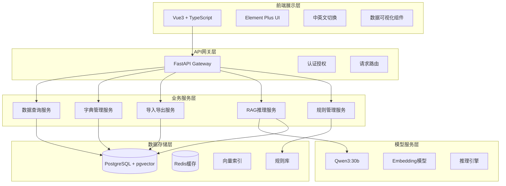
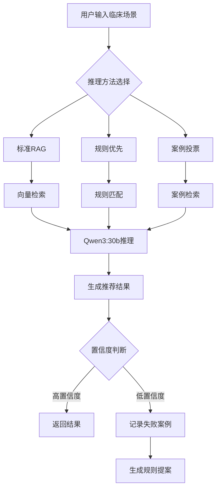

帮我设计一个系统： 1、我要构建一个 acrac 数据展示的页面，可以按 panel、topic、virant、procedure  进行查询，检索，2、支持中英文系统切换，3、支持对各数据字典进行查看、新增、修改；4、支持从ACRac 数据导入和导出， 5、 数据库采用 PostgreSQL 支持对不同字段的向量检索（panel、topic、virant、procedure） 、6、构建ACRAC的RAG推理服务，使用大模型 qwen3：30b ，实现包括3种推理方法、找出合适的topic， virant、 procedure， 比如找到 topic 显示 检查项目选择的原则，在不同virant 下如何选择检查项目，如果推荐 virant， 现在在这个场景下，最合适的项目和不合适的项目； 7、 当无法找到推理时，记录下来，并将考虑如何构建 ac 规则； 8、对新增的规则，进行审核，并添加到推理中； 


## ACRAC数据展示与推理系统设计方案

### 一、系统架构概述



### 二、核心功能模块设计

#### 1. 数据查询展示模块

**功能设计：**
- 四层级数据结构：Panel → Topic → Variant → Procedure
- 多维度查询：关键词搜索、分类筛选、智能推荐
- 分页展示：支持大数据量的分页加载
- 详情查看：展示完整的推荐理由和证据链

**技术实现：**
```
前端：Vue3 + TypeScript + Element Plus
后端：FastAPI + SQLAlchemy
数据库：PostgreSQL with pgvector extension
缓存：Redis for hot data
```

#### 2. 中英文系统切换

**实现方案：**
- i18n国际化框架
- 数据库双语字段存储
- 前端动态语言切换
- API响应语言适配

#### 3. 数据字典管理

**功能设计：**
- Panel字典：科室/专科管理
- Topic字典：临床主题管理  
- Variant字典：临床变量管理
- Procedure字典：检查项目管理
- CRUD操作：增删改查功能
- 版本控制：字典变更历史

#### 4. 数据导入导出

**支持格式：**
- Excel (.xlsx, .csv)
- JSON格式
- NDJSON流式格式

**功能特性：**
- 批量导入验证
- 增量更新
- 数据映射配置
- 导出模板下载

#### 5. 向量检索系统

**技术方案：**
```sql
-- PostgreSQL pgvector 扩展
CREATE EXTENSION vector;

-- 创建向量表
CREATE TABLE acrac_embeddings (
    id SERIAL PRIMARY KEY,
    panel_id INTEGER,
    topic_id INTEGER,
    variant_id INTEGER,
    procedure_id INTEGER,
    content TEXT,
    embedding vector(768),
    language VARCHAR(10)
);

-- 创建向量索引
CREATE INDEX ON acrac_embeddings 
USING ivfflat (embedding vector_cosine_ops)
WITH (lists = 100);
```

#### 6. RAG推理服务

**三种推理方法：**

1. **标准RAG推理**
   - 基于向量相似度检索
   - Top-K相关文档召回
   - LLM生成推荐结果

2. **规则优先推理**
   - 先匹配专家规则库
   - 规则不足时启用RAG
   - 规则与RAG结果融合

3. **案例检索投票**
   - 历史案例相似度匹配
   - 多案例投票机制
   - 置信度加权决策

**推理流程：**


#### 7. 规则管理系统

**功能设计：**
- 规则创建：结构化规则编辑器
- 规则审核：多级审核流程
- 规则测试：沙箱环境验证
- 规则发布：版本管理和回滚

#### 8. 失败案例处理

**处理流程：**
1. 记录推理失败的查询
2. 分析失败原因
3. 生成规则提案
4. 专家审核
5. 规则入库

### 三、数据库设计

```sql
-- Panel表
CREATE TABLE panels (
    id SERIAL PRIMARY KEY,
    name_en VARCHAR(255),
    name_zh VARCHAR(255),
    description TEXT,
    created_at TIMESTAMP DEFAULT CURRENT_TIMESTAMP
);

-- Topic表
CREATE TABLE topics (
    id SERIAL PRIMARY KEY,
    panel_id INTEGER REFERENCES panels(id),
    name_en VARCHAR(255),
    name_zh VARCHAR(255),
    description TEXT
);

-- Variant表
CREATE TABLE variants (
    id SERIAL PRIMARY KEY,
    topic_id INTEGER REFERENCES topics(id),
    description_en TEXT,
    description_zh TEXT,
    clinical_context TEXT
);

-- Procedure表
CREATE TABLE procedures (
    id SERIAL PRIMARY KEY,
    variant_id INTEGER REFERENCES variants(id),
    name_en VARCHAR(255),
    name_zh VARCHAR(255),
    recommendation_en TEXT,
    recommendation_zh TEXT,
    appropriateness_category VARCHAR(50),
    rating DECIMAL(3,1),
    soe VARCHAR(50),
    adult_rrl VARCHAR(50),
    peds_rrl VARCHAR(50)
);

-- 推理日志表
CREATE TABLE inference_logs (
    id SERIAL PRIMARY KEY,
    query_text TEXT,
    inference_method VARCHAR(50),
    result JSONB,
    confidence_score DECIMAL(3,2),
    success BOOLEAN,
    created_at TIMESTAMP DEFAULT CURRENT_TIMESTAMP
);

-- 规则表
CREATE TABLE rules (
    id SERIAL PRIMARY KEY,
    rule_name VARCHAR(255),
    rule_content JSONB,
    status VARCHAR(50), -- draft, review, approved, published
    created_by INTEGER,
    approved_by INTEGER,
    version INTEGER,
    created_at TIMESTAMP DEFAULT CURRENT_TIMESTAMP
);
```

### 四、实施步骤

#### 第一阶段：基础功能（2-3周）

1. **环境搭建**
   - PostgreSQL + pgvector安装配置
   - Python环境：FastAPI + SQLAlchemy
   - 前端环境：Vue3 + TypeScript
   - Docker容器化部署

2. **数据导入**
   - 设计数据模型
   - 实现Excel数据导入
   - 数据清洗和标准化
   - 建立向量索引

3. **基础查询功能**
   - RESTful API开发
   - 四层级数据查询
   - 分页和筛选
   - 前端展示界面

#### 第二阶段：高级功能（3-4周）

1. **向量检索实现**
   - Embedding模型集成
   - 向量化处理pipeline
   - 相似度检索API
   - 检索结果优化

2. **中英文切换**
   - i18n框架集成
   - 界面多语言适配
   - 数据双语展示
   - 语言偏好存储

3. **数据字典管理**
   - CRUD界面开发
   - 权限控制
   - 审计日志
   - 数据验证

#### 第三阶段：智能推理（4-5周）

1. **Qwen3模型部署**
   - 模型服务器搭建
   - API接口封装
   - 负载均衡配置
   - 性能优化

2. **RAG推理实现**
   - 三种推理方法开发
   - Prompt工程优化
   - 结果评分机制
   - 推理链路追踪

3. **规则引擎**
   - 规则DSL设计
   - 规则解析器
   - 规则执行引擎
   - 规则管理界面

#### 第四阶段：完善优化（2-3周）

1. **失败处理机制**
   - 失败案例收集
   - 原因分析模块
   - 规则提案生成
   - 审核流程实现

2. **系统优化**
   - 性能测试和优化
   - 缓存策略实施
   - 日志和监控
   - 用户反馈机制

3. **部署上线**
   - 生产环境配置
   - 数据迁移
   - 用户培训
   - 运维文档

### 五、技术栈建议

**后端技术栈：**
- 语言：Python 3.10+
- 框架：FastAPI
- ORM：SQLAlchemy
- 数据库：PostgreSQL 15 + pgvector
- 缓存：Redis
- 队列：Celery + RabbitMQ
- 模型服务：vLLM/TGI

**前端技术栈：**
- 框架：Vue 3.3+
- 语言：TypeScript
- UI库：Element Plus
- 状态管理：Pinia
- 国际化：vue-i18n
- 图表：ECharts

**部署技术栈：**
- 容器：Docker + Docker Compose
- 编排：Kubernetes (可选)
- 反向代理：Nginx
- 监控：Prometheus + Grafana
- 日志：ELK Stack

### 六、关键技术要点

1. **向量检索优化**
   - 使用HNSW算法提升检索速度
   - 分层索引策略
   - 混合检索（向量+关键词）

2. **推理服务优化**
   - 模型量化加速
   - 批处理推理
   - 结果缓存策略

3. **数据一致性**
   - 事务管理
   - 乐观锁机制
   - 数据版本控制

4. **安全性考虑**
   - JWT认证
   - 角色权限控制
   - 数据加密存储
   - 审计日志

这个设计方案从基础功能开始，逐步构建完整的ACRAC系统，确保每个阶段都有可交付的成果。您可以根据实际需求调整各个阶段的优先级和具体实现细节。